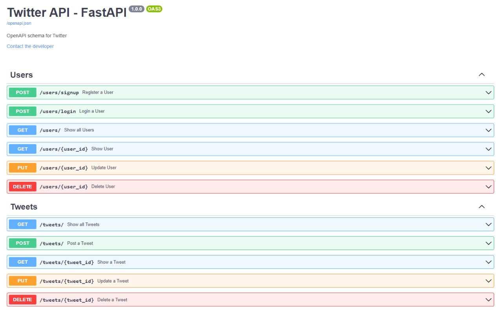
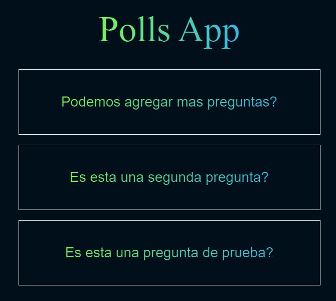

# backend_projects
My backend projects in Flask, FastAPI, Django

Using Python:
- ### FastAPI
    - **Fundamentals:** A project that includes the basic concepts involved in backend as path operations, (request bodies, path and query parameters and validations). [link](./fastapi/fundamentals/main.py)
    - **Modularization:** Advanced concepts and best practices to develop FastAPI applications (forms, cookies and headers). [link](./fastapi/modularization/main.py)
    - **Twitter API:** Profesional application to basic simulation of twitter. [link](./fastapi/twitter-api/main.py)

- ### Flask
    - **Flask Fundamentals:** Basic testing, and project CRUD to simulate TODO list.
- ### Django
    - **Django Awards** Basic and intermedian Django (Testing, Static Files, Django Admin) [link](./django/awards/awards/manage.py)

